# Website Comparison and End-User Description

## Website described

**Psychotherapeutische Praxis Dr. Alexander Kretzschmar**  
Temporary Hostinger site: `https://lightpink-wolf-142779.hostingersite.com/`
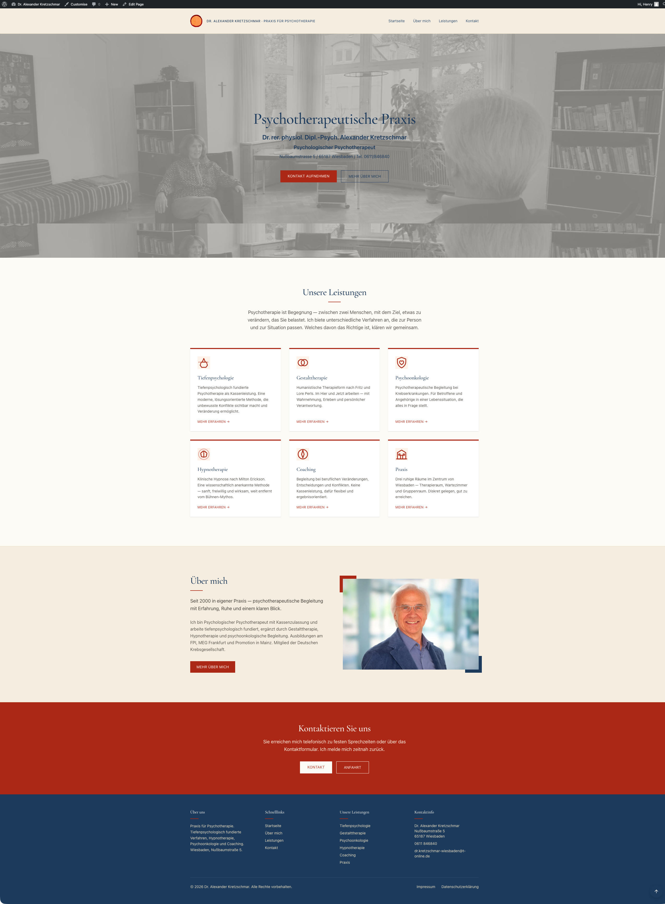

## Comparison site

**Existing website:** `https://kretzschmar-wiesbaden.de/`
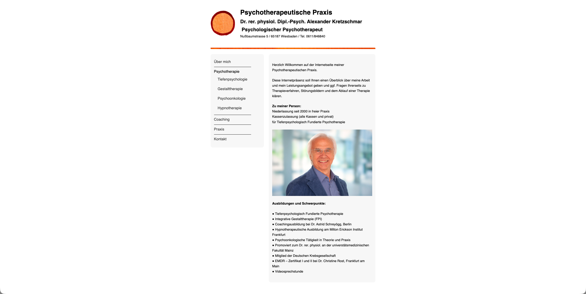

---

# 1. General impression of the new website

The new website presents the psychotherapeutic practice of **Dr. Alexander
Kretzschmar** in Wiesbaden in a calm, professional, modern and visually
restrained way. The design uses a light beige background, dark blue typography
and red accent colours. This gives the website a serious, trustworthy and
appropriate appearance for a psychotherapy practice.

The site is structured as a modern psychotherapy practice website. It
contains a landing page, a clear header navigation, dedicated content pages and
a footer that appears
consistently across all pages. The design avoids unnecessary visual clutter
and is generally suited for modern medical / life sciences practices. The design
instead focuses on clarity, readability and confidence-building information
required for modern websites.

---

# 2. Landing page

The landing page opens with a wide hero section showing a large background image
of a therapy-room situation. The image is displayed in a muted grey tone with an
overlay, which keeps the user's focus on the text in the centre of the screen.
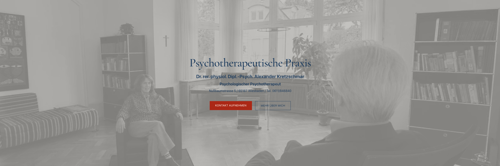
The parallax effect is modern but conservative enough for any kind of
medical practice.

The main heading reads:

> **Psychotherapeutische Praxis**

Below this, the practitioner is introduced as:

> **Dr. rer. physiol. Dipl.-Psych. Alexander Kretzschmar**  
> **Psychologischer Psychotherapeut**

The address and telephone number are also shown directly in the hero area. This
immediately gives visitors the essential information: who the practitioner is,
what kind of practice it is, where the practice is located and how it can be
contacted.

Two call-to-action buttons are placed below the main text:

- **Kontakt aufnehmen**
- **Mehr über mich**

These two buttons give users two clear options: they can either contact the
practice immediately or first learn more about the therapist. Again a modern
approach providing users with a 'saving time' approach to viewing websites.

---

# 3. Parallax effect on the landing page

The landing page uses a large background image in the hero area that appears to
remain visually stable while the page content moves. This creates a *
*parallax-style effect**.

The effect gives the page a more modern and dynamic visual impression than a
purely static layout. It is used subtly and does not distract from the
professional purpose of the site. This is suitable for a psychotherapy
practice, or other medical practice where the design should feel calm,
serious and reassuring rather than overly animated or decorative.

---

# 4. Header and navigation

The header contains the practice logo and name on the left:

> **Dr. Alexander Kretzschmar · Praxis für Psychotherapie**

On the right, the navigation menu contains the following main links and
pull-down sub-menus:
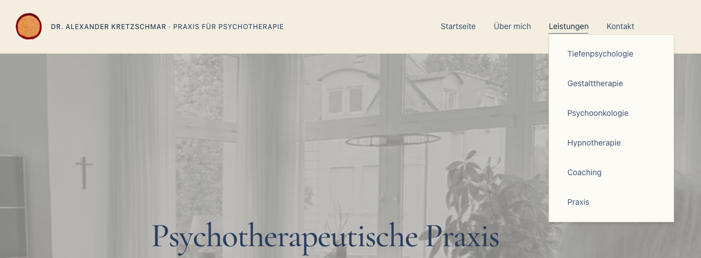

## Startseite

This link leads back to the landing page.

## Über mich

This link opens the page with personal and professional information about Dr.
Kretzschmar.

## Leistungen

This link opens the overview of therapeutic and practice-related services. It
also contains a dropdown submenu.

## Kontakt

This link opens the contact page with address, telephone number, email address,
consultation times, route information and contact form.

---

# 5. Leistungen submenu

When the **Leistungen** menu is opened, the following submenu items appear:

## Tiefenpsychologie

This submenu point leads to information about depth-psychologically founded
psychotherapy.

## Gestalttherapie

This submenu point leads to information about Gestalt therapy.

## Psychoonkologie

This submenu point leads to information about psychotherapeutic support in
connection with cancer.

## Hypnotherapie

This submenu point leads to information about clinical hypnosis according to
Milton Erickson.

## Coaching

This submenu point leads to information about coaching in connection with
professional decisions and personal development.

## Praxis

This submenu point leads to information about the practice rooms and practice
environment.

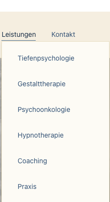

The submenu is clean and readable. The individual points are well spaced, making
them easy to select. It gives users quick access to the main service areas
without overcrowding the main navigation bar.

---

# 6. Landing page sections

## 6.1 Unsere Leistungen

The first main content section after the hero area is titled:

> **Unsere Leistungen**

It briefly introduces psychotherapy as a process of encounter and change. Below
the introductory text, the services are displayed in six separate cards
allowing the user quick access to all services the practice offers.

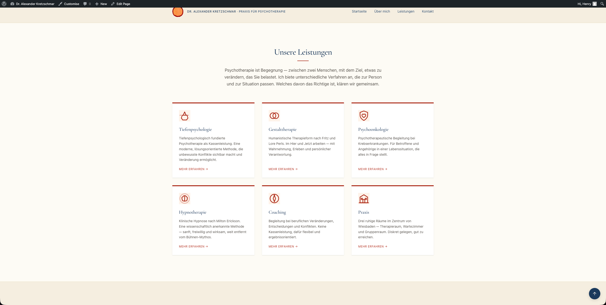

It consists of six cards, which are:

### Tiefenpsychologie

Depth-psychologically founded psychotherapy as a health-insurance service.

### Gestalttherapie

Humanistic therapy in the here and now.

### Psychoonkologie

Psychotherapeutic support for people affected by cancer.

### Hypnotherapie

Clinical hypnosis according to Milton Erickson.

### Coaching

Support with professional changes, decisions and conflicts.

### Praxis

Information about the quiet practice rooms in central Wiesbaden.

Each card includes a short description and a **Mehr erfahren** link. This makes
the landing page easy to scan and allows visitors to move directly to the topic
that is relevant to them.

## 6.2 Über mich section on the landing page

The next section introduces Dr. Kretzschmar with a short text and a portrait
photograph.

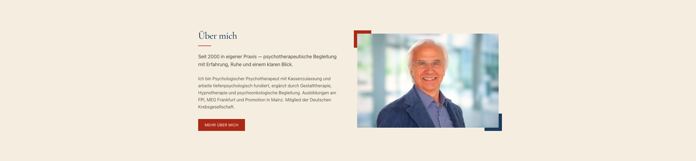

The text explains that the practice has existed for many years and highlights
experience, calmness and a clear therapeutic approach. This section helps build
trust by giving the visitor a first personal impression of the therapist.

A red button labelled **Mehr über mich** leads to the full profile page.

## 6.3 Contact call-to-action

Before the footer, there is a strong red section titled:

> **Kontaktieren Sie uns**

It tells users that they can reach the practice by telephone during consultation
hours or by using the contact form.

It contains two buttons:

- **Kontakt**
- **Anfahrt**

This section is visually prominent and works well as a final invitation to
the user to take action and contact the practice.

---

# 7. Common Footer

The footer is consistent across all pages and uses a dark blue background. It
gives the website a stable and professional ending. It also provides important
navigation and contact information for users who have scrolled to the bottom of
a page.

The footer contains four main columns.

## 7.1 Common Footer - Über uns

This column briefly describes the practice:

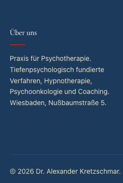

It gives users a short summary of what the practice offers and where it is
located.

## 7.2 Schnelllinks

This column provides quick access to the main pages:

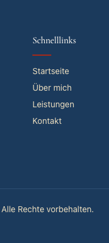

## 7.3 Unsere Leistungen

This column repeats the service areas:

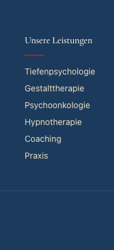

This is useful because users who reach the bottom of a page can still navigate
directly to a specific service.

## 7.4 Kontaktinfo

This column gives the contact details:

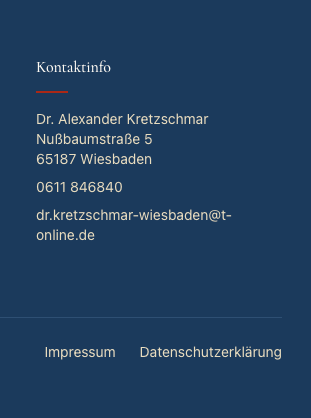

At the bottom of the footer there is a copyright line:

> **© 2026 Dr. Alexander Kretzschmar. Alle Rechte vorbehalten.**

In the bottom-right corner, there is a circular **back-to-top navigation button
** with an upward arrow. This allows users to return quickly to the top of the
page. It is especially useful on longer pages such as the contact page.
The **back-to-top navigation button** is available on all pages of the site.

There are also links to:

- **Impressum**
- **Datenschutzerklärung**

Important Note on the Impressum 

**Why it should not be live in its current state!**

It should not be on a live website because it is:

- Incomplete — contact, authority, VAT and professional details are missing.
- Visibly unfinished — editorial notes and placeholders are still present.
- Potentially legally outdated — it still refers to § 5 TMG rather than § 5 DDG.
- Possibly misleading — “vermutlich Hessen” is a guess, not a verified legal
  statement.
- Unprofessional — it undermines confidence in a regulated healthcare-related
  practice.
- Potentially stale — the EU ODR platform reference is no longer current in
  2026.

**What should happen before publication**

Before the website goes live, the Impressum should be replaced with a final,
verified version containing:

- Correct heading: Angaben gemäß § 5 DDG
- Full provider name and address
- Final telephone number and email address
- Confirmed professional title
- Confirmed state/country where the title was awarded
- Confirmed approving/licensing authority
- Correct chamber information
- Current links to applicable professional regulations
- Correct VAT wording
- Reviewed consumer dispute-resolution wording
- § 18 MStV wording only if relevant to the site content

In its current state, this Impressum is a draft with legal placeholders and
should be treated as not publishable.

Important Note on the Datenschutzerklärung 

**Why it should not be live in its current state!**

It should not be on a live website because:

- It looks like a generic template, not a tailored privacy policy.
- The contact information is incomplete for data protection purposes.
- It refers to a “Datenschutzbeauftragten”, although no data protection officer
  is named.
- The supervisory authority section is too generic.
- The BfDI link may be outdated.
- The cookie wording is technically questionable.
- It mixes up server log files and cookies.
- It says server-log information allows no conclusions about the person, which
  may be too absolute.
- There is no clear legal basis for each processing activity.
- Retention periods are vague.
- The Google Fonts section is a major red flag.
- The Google Fonts wording is too uncertain for a live legal document.
- There is no proper explanation of third-country data transfer.
- The cookie section is too generic and may not match the site.
- No cookie-consent logic is described.
- No hosting provider is identified.
- No contact form processing is described.
- No email communication processing is described properly.
- Special-category health data is not addressed.
- It does not reflect the sensitivity of a psychotherapeutic practice.
- It does not mention WordPress-specific processing.
- The SSL section is too superficial.
- The wording is not specific enough about recipients of data.
- It does not clearly distinguish between necessary and optional processing.
- It may create a false sense of compliance.
- It may contradict the real website.
- It should be reviewed together with the live site, not in isolation.

### Core conclusion

This Datenschutzerklärung should not go live because it is generic, incomplete,
partly unclear, and not sufficiently adapted to a psychotherapeutic practice
website. The most serious issues are the missing or unclear data protection
contact details, the unexplained reference to a Datenschutzbeauftragter, the
weak Google Fonts section, the vague cookie/server-log wording, and the absence
of any serious treatment of sensitive health-related contact enquiries.

---

# 8. Über mich page

The **Über mich** page introduces Dr. Kretzschmar personally and professionally.

At the top, the page has the heading:

> **Über mich**

Below it is the subtitle:

> **Psychotherapeutische Begleitung mit Erfahrung, Ruhe und einem klaren Blick.
**

The main content section combines a portrait photograph with a text block. The
text explains that Dr. Kretzschmar has worked as a psychological psychotherapist
in his own practice since 2000.

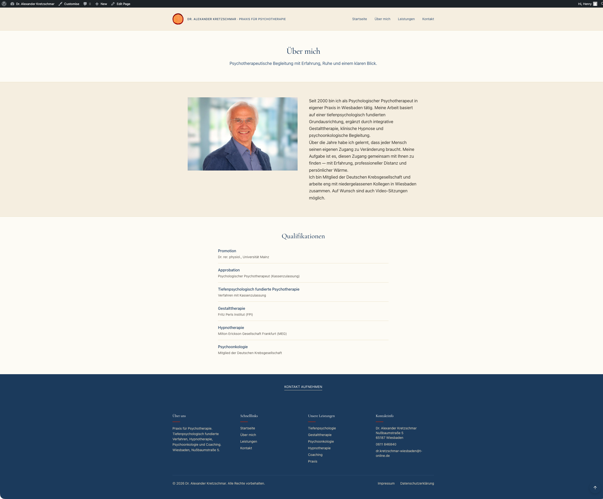

It describes his work as being based on a depth-psychological foundation and
complemented by integrative Gestalt therapy, clinical hypnosis and
psycho-oncological support.

The page presents the therapist as experienced, calm and professionally
grounded. It also mentions membership of the German Cancer Society and
cooperation with colleagues in Wiesbaden. Video sessions are also mentioned as
possible.

## 8.1 Qualifications section

Below the main profile text, the page lists qualifications in a structured
format:

### Promotion

Dr. rer. physiol., Universität Mainz

### Approbation

Psychologischer Psychotherapeut, Kassenzulassung

### Tiefenpsychologisch fundierte Psychotherapie

Verfahren mit Kassenzulassung

### Gestalttherapie

Fritz Perls Institut

### Hypnotherapie

Milton Erickson Gesellschaft Frankfurt

### Psychoonkologie

Mitglied der Deutschen Krebsgesellschaft

The page ends with a **Kontakt aufnehmen** link before the footer.

---

# 9. Leistungen page

The **Leistungen** page gives a concise overview of the available services.

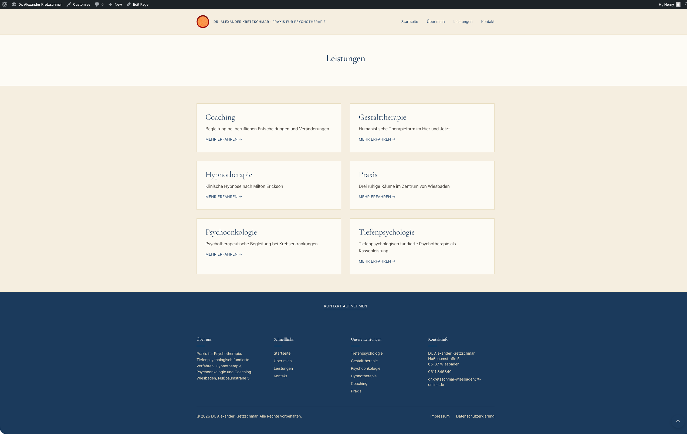

The page heading is:

> **Leistungen**

Below the heading, six service cards are shown in a two-column layout.

The cards are:

## Coaching

Begleitung bei beruflichen Entscheidungen und Veränderungen.

## Gestalttherapie

Humanistische Therapieform im Hier und Jetzt.

## Hypnotherapie

Klinische Hypnose nach Milton Erickson.

## Praxis

Drei ruhige Räume im Zentrum von Wiesbaden.

## Psychoonkologie

Psychotherapeutische Begleitung bei Krebserkrankungen.

## Tiefenpsychologie

Tiefenpsychologisch fundierte Psychotherapie als Kassenleistung.

Each card includes a **Mehr erfahren** link. The layout is clear, balanced and
easy to understand. It gives visitors a quick overview without overwhelming them
with too much text.

---

# 10. Kontakt page

The **Kontakt** page is practical and user-focused.

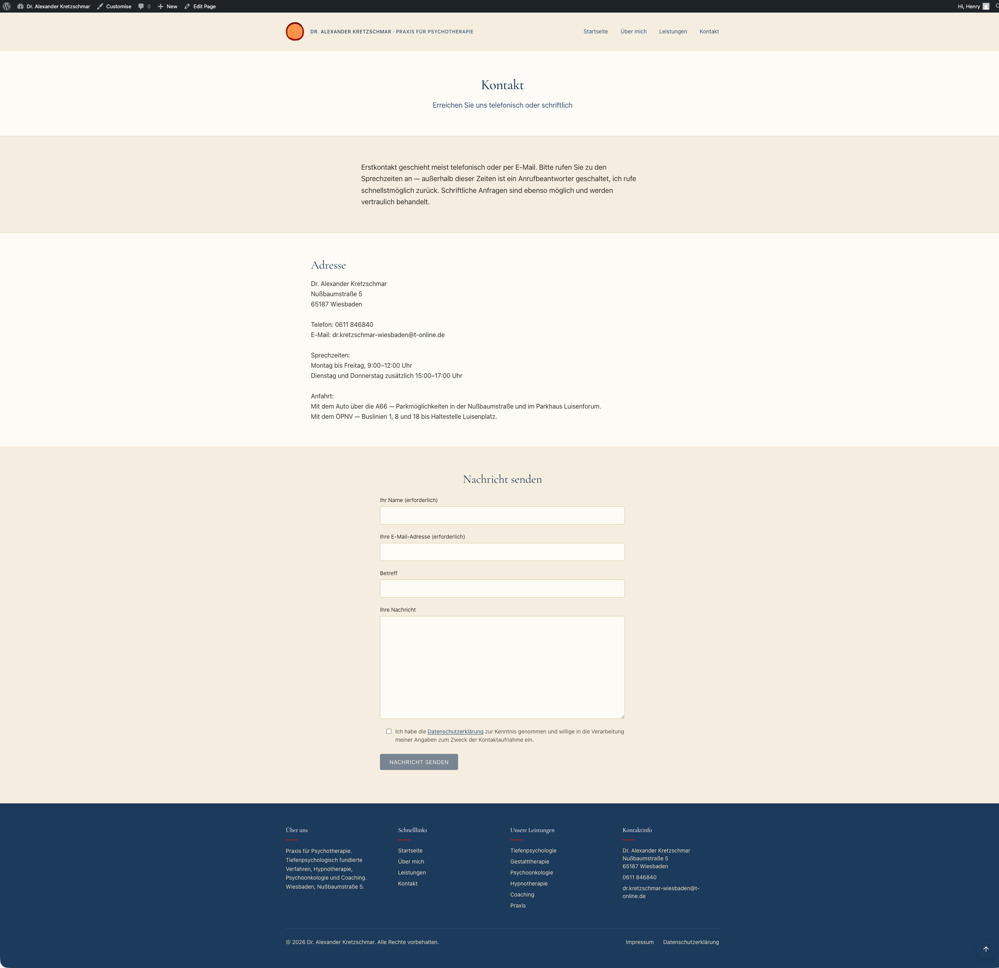

At the top, it has the heading:

> **Kontakt**

and the subtitle:

> **Erreichen Sie uns telefonisch oder schriftlich**

The introductory text explains that initial contact usually takes place by
telephone or email. It also explains that callers may leave a message on the
answering machine outside consultation hours and that written enquiries are also
possible and treated confidentially.

## 10.1 Address and contact information

The page provides:

> **Dr. Alexander Kretzschmar**  
> **Nußbaumstraße 5**  
> **65187 Wiesbaden**

Telephone:

> **0611 846840**

Email:

> **dr.kretzschmar-wiesbaden@t-online.de**

## 10.2 Consultation hours

The telephone consultation times are listed as:

> **Montag bis Freitag, 9:00–12:00 Uhr**  
> **Dienstag und Donnerstag zusätzlich 15:00–17:00 Uhr**

## 10.3 Directions

The page explains that the practice can be reached by car via the A66 and that
parking is available in the Nußbaumstraße and at the Parkhaus Luisenforum.

It also mentions public transport access using bus lines 1, 8 and 18 to the
Luisenplatz stop.

## 10.4 Contact form

The lower part of the page contains a contact form titled:

> **Nachricht senden**

The form includes fields for:

- **Ihr Name**
- **Ihre E-Mail-Adresse**
- **Betreff**
- **Ihre Nachricht**

There is also a checkbox confirming that the user has read the privacy policy
and agrees to the processing of the submitted data for the purpose of contact.

The form ends with a **Nachricht senden** button.

---

# 11. Comparison with kretzschmar-wiesbaden.de

The older comparison site, `https://kretzschmar-wiesbaden.de/`, is functional
and informative. It clearly identifies the practice, the practitioner, the
address, telephone number and the available therapeutic areas. However, 
there are numerous errors on the old site and the Impressum and Datenschutz 
pages are not compliant with current legal requirements in the EU and Germany.

The older site contains useful information and gives visitors access to
important pages such as information about the practitioner, psychotherapy,
coaching, the practice and contact details.

However, in terms of visual presentation, the older site appears more
traditional and less modern. It is primarily information-led and has a simpler,
more dated visual style.

By comparison, the new Hostinger site is more modern, more structured and
more polished. It uses:

- a large landing-page hero image;
- a subtle parallax-style effect;
- clear call-to-action buttons;
- service cards;
- a dedicated landing-page structure;
- a consistent dark-blue footer;
- stronger visual hierarchy;
- more generous spacing;
- a more contemporary colour system.

The older site has the advantage of being direct and information-rich. Its main
strength is clarity. It gives users the practical information they need.

The new site, however, communicates the same professional content in a more
contemporary and user-friendly way. It appears more visually refined and gives a
stronger first impression.

---

# 12. Overall professional assessment

Overall, the new website gives a more professional first impression than the
older comparison site.

Its strengths are:

- calm and appropriate design for a psychotherapy practice;
- clear navigation;
- professional use of colour;
- strong landing-page structure;
- well-organised service overview;
- consistent footer across pages;
- clear contact path;
- modern visual presentation.

The site guides the user logically from introduction, to services, to personal
background, to contact. This makes it suitable for end users who want to
understand quickly who the therapist is, what services are offered and how to
make contact.

The older `kretzschmar-wiesbaden.de` site remains useful and credible, but 
is error prone. The new site presents the practice in a more modern, 
accessible and visually professional manner.
